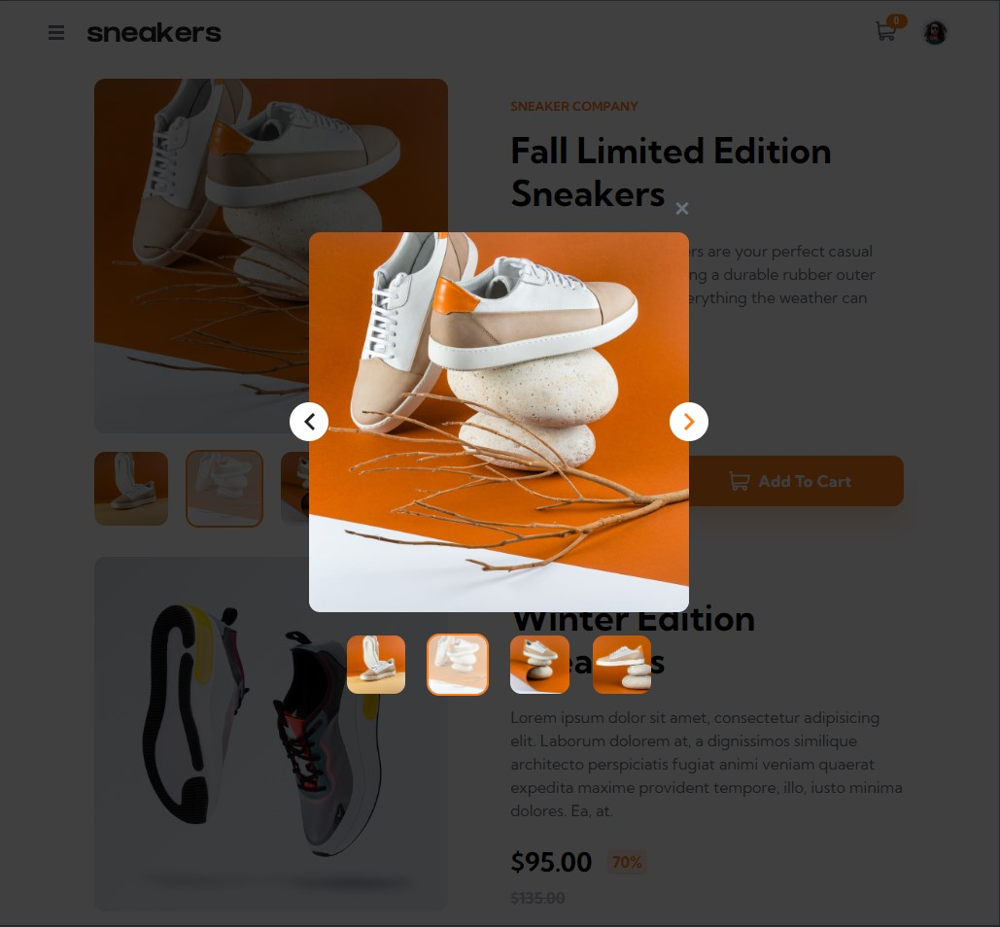
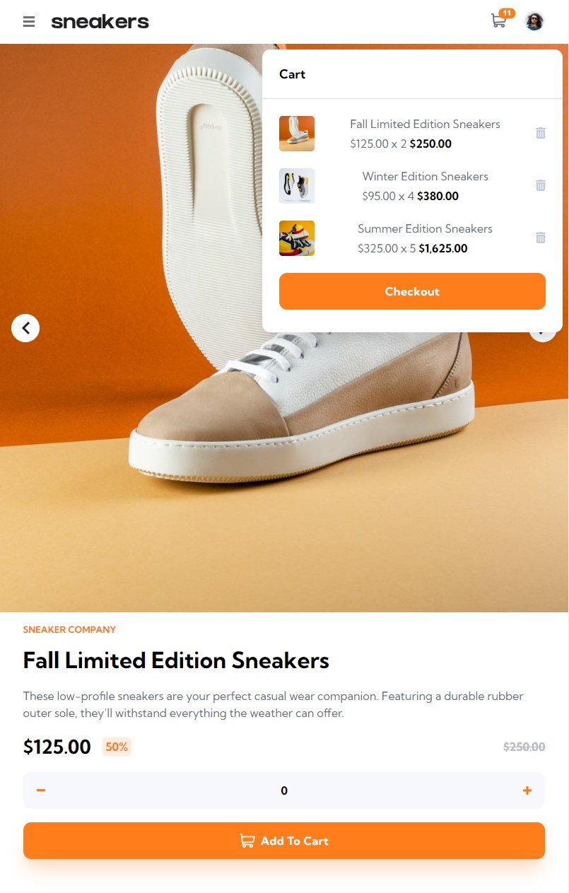
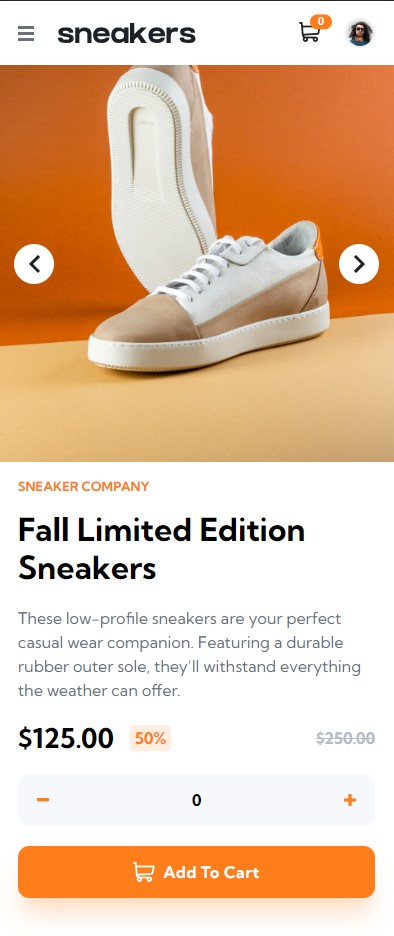
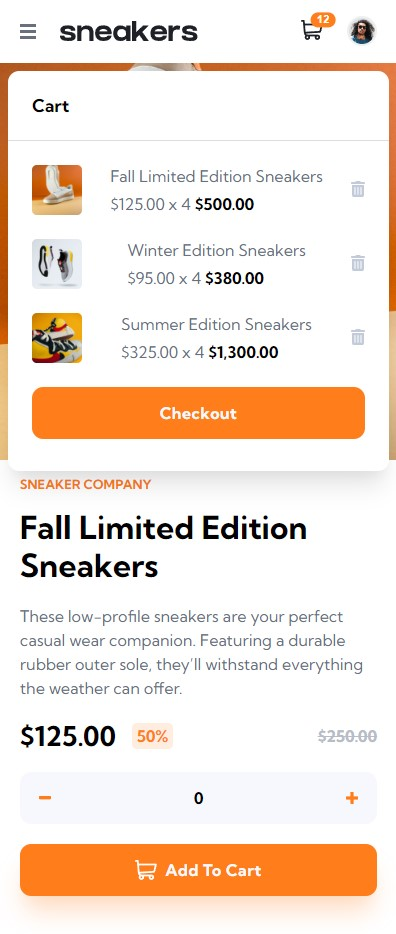

- Live Site URL: [here](https://kevinburle.github.io/ecommerce-product-page-vanilla-js/)

# Frontend Mentor - E-commerce product page solution

This is a solution to the [E-commerce product page challenge on Frontend Mentor](https://www.frontendmentor.io/challenges/ecommerce-product-page-UPsZ9MJp6). Frontend Mentor challenges help you improve your coding skills by building realistic projects.

## Table of contents

- [Overview](#overview)
  - [The challenge](#the-challenge)
  - [Screenshot](#screenshot)
- [My process](#my-process)
  - [Built with](#built-with)
- [Author](#author)
## Overview

### The challenge

Users should be able to:

- View the optimal layout for the site depending on their device's screen size
- See hover states for all interactive elements on the page
- Open a lightbox gallery by clicking on the large product image
- Switch the large product image by clicking on the small thumbnail images
- Add items to the cart
- View the cart and remove items from it

Some extra features I added:

- Display one or more products dynamically
- Modify the products data by the data.js file
- Calculate the height of the cart dynamically according to the number of items
- Open the cart after adding a product
- Close the cart after a certain time after adding a product
- Application works the same way with one or more products

### Screenshot

## My process

### Built with

- Semantic HTML5 markup
- CSS custom properties
- Flexbox
- CSS Grid
- ES6 import
- Object Oriented Programming
- Mobile-first workflow
- Vanilla JavaScript
- No CSS framework used

## Author

- Frontend Mentor - [@kevinburle](https://www.frontendmentor.io/profile/kevinburle)
- Twitter - [@kevinburle](https://twitter.com/kevinburle)

